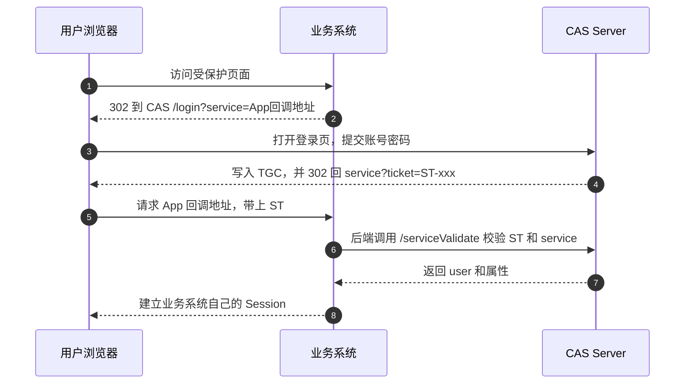
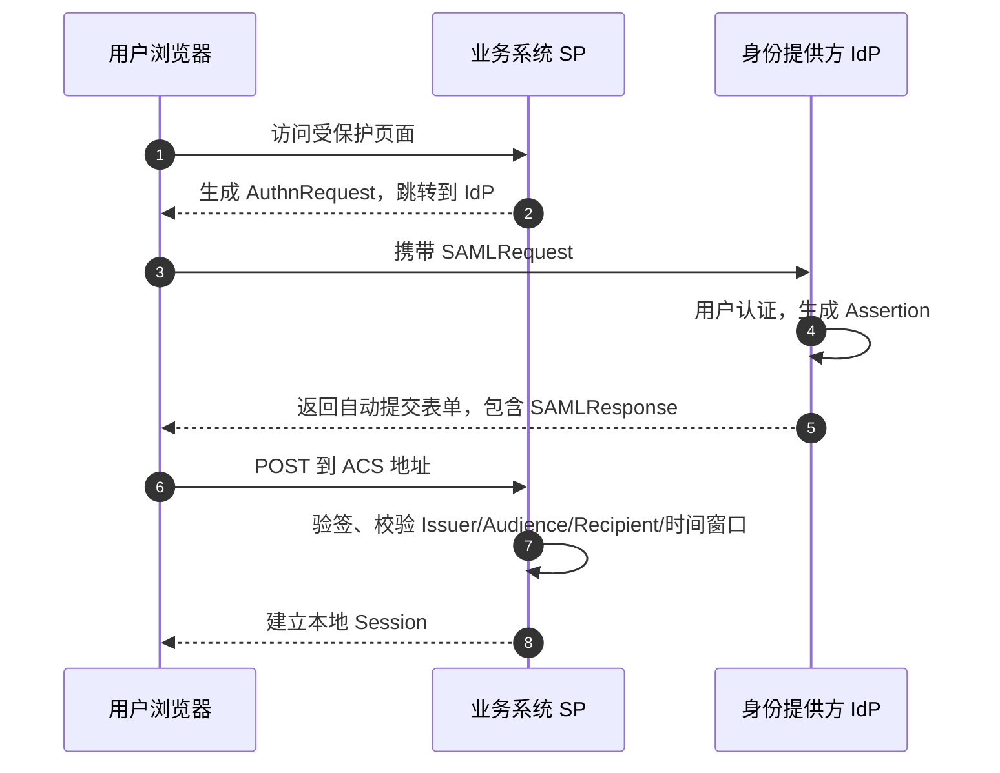
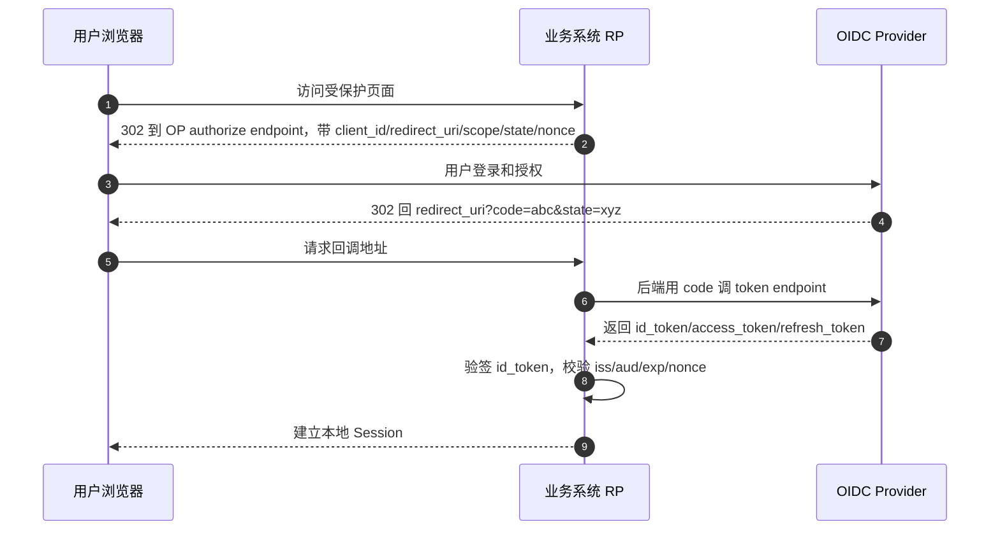

## 讨论 SSO 时先区分两条链路
CAS、SAML、OIDC 都能做单点登录，但它们解决问题的方式并不一样。用户看到的都是浏览器跳转：访问业务系统、跳到统一登录页、登录、再跳回来。协议差异主要藏在两条链路里。
- 前通道：浏览器负责跳转，把 `ticket`、`SAMLResponse` 或 `code` 带回业务系统。
- 后通道：业务系统服务器和认证中心直接通信，例如 CAS 校验 `ST`，OIDC 用 `code` 换 token。
判断一个 SSO 接入是否可靠，不能只看“登录能不能跳回来”，还要看业务系统最后信任的凭证是什么、校验动作发生在哪里、有没有绑定当前应用和当前登录请求。

---

## CAS：票据模式，业务系统必须回认证中心校验
CAS 的核心不是把用户身份直接交给业务系统，而是先发一张短生命周期、一次性的 Service Ticket，通常写作 `ST`。业务系统收到 `ST` 后，要从后端调用 CAS 的校验接口。只有 CAS 返回校验成功和用户身份后，业务系统才应该建立自己的本地会话。

### 参与角色
- 用户浏览器：负责访问业务系统和 CAS 登录页，也会保存 CAS 全局登录 Cookie。
- 业务系统：CAS 文档里通常叫 Service，负责保护自己的页面和建立本地 Session。
- CAS Server：统一认证中心，负责登录、签发票据、校验票据。

### 关键对象
- `TGC`：Ticket Granting Cookie，CAS 登录成功后写到浏览器，用来表示用户在 CAS 侧已经登录。
- `TGT`：Ticket Granting Ticket，CAS 服务端保存的全局登录状态。
- `ST`：Service Ticket，发给某一个业务系统的一次性票据。
业务系统通常只接触 `ST`。`TGC` 和 `TGT` 主要在 CAS 侧维持全局登录状态，用来让用户访问第二个业务系统时少输一次密码。

### 典型流程


### 业务系统需要校验什么
- `ST` 必须由后端提交给 CAS 校验，不能只靠前端或只看字符串格式。
- 校验请求里的 `service` 必须和签发 `ST` 时的 service 一致，否则票据不能跨系统使用。
- `ST` 成功校验后应立即失效，重复使用应失败。
- 业务系统建立的是自己的本地 Session。CAS 登录状态和业务系统 Session 是两层状态，不是一回事。

### 实现时常见的问题
- 只判断 URL 里存在 `ticket` 就认为登录成功，这是严重错误。
- `service` 参数拼接不稳定，导致本地、测试、生产环境回调地址不一致，票据校验失败。
- 多个业务系统共享同一个登录中心时，退出登录需要单点登出配合；只清业务系统 Session 不等于清 CAS 全局登录状态。
- 如果网关、反向代理改写了协议或域名，CAS 看到的 service 和业务系统配置的 service 可能对不上。

---

## SAML：断言模式，业务系统本地验证签名和约束
SAML 更偏企业身份集成。认证中心叫 Identity Provider，简称 `IdP`；业务系统叫 Service Provider，简称 `SP`。登录完成后，`IdP` 返回的是 `SAMLResponse`，里面包含一个或多个 `Assertion`。Assertion 是 XML，通常带签名，里面描述用户是谁、什么时候认证、断言发给哪个 SP、有效期到什么时候。

### 参与角色
- `IdP`：身份提供方，负责认证用户并签发 SAML 响应。
- `SP`：服务提供方，也就是业务系统，负责生成登录请求、接收响应、校验断言。
- 浏览器：负责在 `IdP` 和 `SP` 之间携带表单 POST 或 Redirect 参数。

### SP 发起登录的流程


### SAMLResponse 里通常关心哪些字段
- `Issuer`：断言来自哪个 IdP。SP 需要确认它是自己配置过、信任过的 IdP。
- `NameID`：用户主标识，可能是邮箱、员工号或不可读的持久 ID。
- `AttributeStatement`：附带用户属性，例如邮箱、部门、姓名、角色。
- `AudienceRestriction`：限制这份断言只能给哪个 SP 使用。
- `Recipient` / `Destination`：限制响应应该投递到哪个 ACS 地址。
- `NotBefore` / `NotOnOrAfter`：断言生效和失效时间。
- `InResponseTo`：把响应绑定到本次登录请求，降低重放风险。

### SP 侧校验重点
- 必须验证 XML 签名。签名证书应来自 IdP 元数据或明确配置，不能从请求里临时信任。
- 必须检查 `Audience`，否则给 A 系统的断言可能被拿到 B 系统尝试复用。
- 必须检查时间窗口，并允许很小的时钟偏差，但不能无限放宽。
- SP 发起流程里应校验 `InResponseTo`，确认响应对应本次登录请求。
- 接收 ACS 地址要固定，避免被开放重定向或错误配置带偏。

### 实现时常见的问题
- 把 XML 解析当普通字符串处理，容易踩 XML Signature Wrapping 这类坑。应使用成熟 SAML 库。
- IdP 证书轮换时没有同步更新 SP 配置，导致突然全员无法登录。
- 只验证 Response 签名，不确认真正被使用的 Assertion 是否在签名覆盖范围内。
- 把 IdP 发来的角色属性直接映射成系统管理员权限，没有做租户、应用、组织范围限制。

---

## OIDC：OAuth 2.0 之上的身份层
OIDC 可以理解为在 OAuth 2.0 授权流程上加了一层标准化的身份信息。它引入了 `id_token`，用来告诉业务系统当前登录用户是谁。常见角色包括 `OP` 和 `RP`：`OP` 是 OIDC Provider，也就是认证中心；`RP` 是 Relying Party，也就是业务系统。

### Authorization Code Flow
Web 应用最常见的是 Authorization Code Flow。浏览器前通道只带回 `code`，真正的 token 交换发生在业务系统后端和 OP 之间。这样可以避免 `id_token`、`access_token` 直接暴露在浏览器跳转 URL 里。


### `id_token` 里常见字段
- `iss`：签发方，必须等于预期 OP。
- `sub`：用户在该 OP 下的稳定主体标识。不要假设它一定是邮箱。
- `aud`：受众，通常应包含当前应用的 `client_id`。
- `exp` / `iat`：过期时间和签发时间。
- `nonce`：绑定本次登录请求，防止把旧 token 拿来重放。
- `email`、`name`、`picture` 等：用户资料字段，是否存在取决于 scope 和 OP 配置。

### 公钥验签的实际含义
JWT 由 Header、Payload、Signature 三段组成。Header 里通常有 `alg` 和 `kid`。业务系统会根据 `kid` 去 OP 的 JWKS 里找到对应公钥，然后验证 Signature。验证通过只能说明 token 没被篡改且确实由对应私钥签出，还不能省略后续字段校验。

```plaintext
header.payload.signature

Header:  { alg: RS256, kid: key-1 }
Payload: { iss, sub, aud, exp, nonce, ... }
Signature: OP 用私钥对前两段签名
```

### RP 侧校验重点
- 根据 `kid` 选择公钥，验证 JWT 签名。
- 限制可接受的 `alg`，不要允许 `none` 或和预期不符的算法。
- 校验 `iss`，避免把其他身份源签发的 token 当成本系统登录结果。
- 校验 `aud` 和必要时的 `azp`，确认 token 是发给当前客户端的。
- 校验 `exp`、`iat`，必要时考虑很小的时钟偏差。
- 校验 `nonce`，确认它和发起登录时保存的 nonce 一致。
- 校验回调里的 `state`，防 CSRF，也用于恢复登录前的跳转目标。

### `id_token` 和 `access_token` 不要混用
`id_token` 面向 RP，用来表达认证结果；`access_token` 面向资源服务器，用来访问 API。很多系统接入 OIDC 时会把两者混在一起，导致 API 侧信任了不该信任的 token，或者登录侧拿 access token 当用户身份。工程实现里最好把“登录会话建立”和“调用 API 授权”分成两条逻辑。

### 实现时常见的问题
- 只 decode JWT，不验签。JWT 的 Payload 本来就是可读的，能 decode 不代表可信。
- 验了签但不校验 `iss`、`aud`、`nonce`，导致跨应用或重放风险。
- JWKS 缓存策略不合理：不缓存会拖慢登录，缓存太久又可能错过密钥轮换。
- 回调地址配置过宽，允许攻击者把授权结果带到非预期地址。
- 把邮箱当唯一用户 ID。邮箱可能变更，`sub` 通常更适合作为外部身份主键。

---

## 把三套协议放到同一组维度里看
如果从实现角度比较，可以按“凭证形态、校验位置、业务系统保存什么状态、出错时排查哪里”来拆。

### 凭证形态
- CAS 回来的是 `ST`，它本身不是最终身份声明，必须回 CAS 校验。
- SAML 回来的是 `SAMLResponse` / `Assertion`，是 XML 形态的身份声明。
- OIDC 回来的是 `code`，后端换到 `id_token`，身份声明通常是 JWT。

### 校验位置
- CAS：业务系统后端调用 CAS 校验接口，最终信任 CAS 返回结果。
- SAML：业务系统本地验 XML 签名和断言约束。
- OIDC：业务系统本地验 JWT 签名和 claim 约束。

### 会话边界
- 三者都不应该直接把认证中心会话当成业务系统会话。业务系统最终都要建立自己的本地 Session 或登录态。
- 认证中心的全局登录态只负责减少重复登录，不等于业务系统授权已经完成。
- 退出登录通常比登录更复杂，因为要同时考虑业务系统本地会话和认证中心会话。

### 排查问题时的切入点
- CAS 登录失败，优先看 `service` 是否一致、`ST` 是否被重复使用、后端校验接口是否可达。
- SAML 登录失败，优先看 ACS 地址、证书、签名覆盖范围、Audience、时间窗口。
- OIDC 登录失败，优先看 `redirect_uri`、`state`、`nonce`、token endpoint、JWKS 和 `aud`。

---

## 选型时不要只看协议名字
新系统通常更推荐 OIDC，因为它和现代 Web、移动端、API 授权体系配合更自然，库和云身份平台支持也更完整。SAML 在企业 SaaS、传统身份平台、集团统一身份接入里仍然非常常见。CAS 更多出现在学校、政企内网、历史系统或已经有 CAS 基建的组织里。
如果系统要同时接多个企业客户，实际选型往往不是三选一，而是业务系统支持 OIDC 和 SAML，内部旧系统再通过网关或身份平台兼容 CAS。关键是把外部身份映射成本系统用户时，设计好主键、租户边界、权限映射和审计记录。

### 工程落地时建议明确的几件事
- 外部身份主键用什么：`sub`、NameID、员工号还是邮箱。
- 同一个邮箱出现在不同租户或不同身份源时，是否允许合并。
- 外部属性如何映射成本系统角色，是否需要人工审批。
- 证书和密钥轮换怎么做，失败时谁能看到告警。
- 登录成功、登录失败、权限映射变更是否有审计日志。
