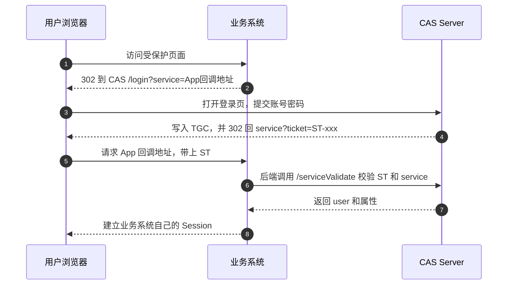
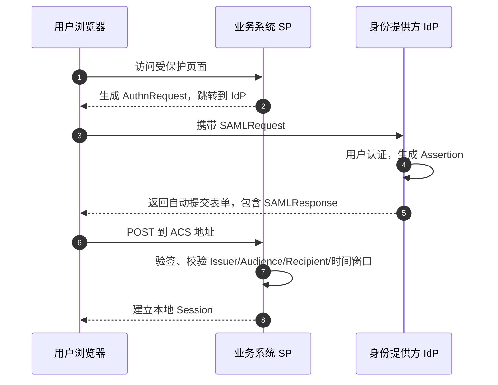
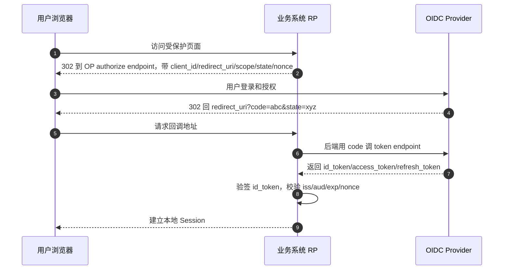

SSO 看起来都是同一件事：访问业务系统、跳到统一登录页、登录、再跳回来。

真正的差别不在跳转，而在业务系统最后信什么凭证、在哪里完成校验、建立什么本地会话。

## 先分清两条链路

前通道是浏览器跳转。它把 `ticket`、`SAMLResponse` 或 `code` 带回业务系统。

后通道是业务系统服务器和认证中心通信。例如 CAS 校验 `ST`，OIDC 用 `code` 换 token。

判断一个 SSO 接入是否可靠，不能只看“能不能跳回来”。要看业务系统最终信任的凭证是什么、校验动作发生在哪里、有没有绑定当前应用和当前登录请求。

## CAS：票据模式，必须回认证中心校验

CAS 的核心不是把完整身份声明直接交给业务系统，而是先发一张短生命周期、一次性的 `Service Ticket`，通常写作 `ST`。

业务系统收到 `ST` 后，要从后端调用 CAS 校验接口。只有 CAS 返回校验成功和用户身份后，业务系统才应该建立自己的本地会话。

参与角色很少：

- 用户浏览器：访问业务系统和 CAS 登录页，保存 CAS 全局登录 Cookie。
- 业务系统：CAS 文档里通常叫 Service，负责保护页面和建立本地 Session。
- CAS Server：统一认证中心，负责登录、签发票据、校验票据。

几个对象容易混：

- `TGC`：Ticket Granting Cookie，CAS 登录成功后写到浏览器。
- `TGT`：Ticket Granting Ticket，CAS 服务端保存的全局登录状态。
- `ST`：Service Ticket，发给某一个业务系统的一次性票据。

业务系统通常只接触 `ST`。`TGC` 和 `TGT` 主要在 CAS 侧维持全局登录状态，让用户访问第二个业务系统时少输一次密码。



CAS 接入最容易错在三点：

- 只判断 URL 里有 `ticket` 就认为登录成功。
- `service` 参数在本地、测试、生产环境拼接不一致。
- 只清业务系统 Session，却以为已经清掉 CAS 全局登录状态。

## SAML：断言模式，本地验证 XML 签名

SAML 更偏企业身份集成。认证中心叫 `IdP`，业务系统叫 `SP`。

登录完成后，`IdP` 返回 `SAMLResponse`，里面包含一个或多个 `Assertion`。Assertion 是 XML，通常带签名，描述用户是谁、什么时候认证、断言发给哪个 SP、有效期到什么时候。



SP 侧重点不是“XML 能不能解析”，而是断言能不能被信任：

- 验证 XML 签名，证书来自 IdP 元数据或明确配置。
- 检查 `Audience`，防止给 A 系统的断言被拿去 B 系统。
- 检查 `Recipient`、`Destination` 和 ACS 地址。
- 检查 `NotBefore`、`NotOnOrAfter`，只允许很小的时钟偏差。
- SP 发起流程里校验 `InResponseTo`，确认响应对应本次登录请求。

SAML 的坑通常在 XML 签名、证书轮换、ACS 地址配置和属性映射。尤其不要把 IdP 发来的角色字段直接映射成系统管理员权限，中间必须有租户、应用和组织范围限制。

## OIDC：OAuth 2.0 之上的身份层

OIDC 可以理解为在 OAuth 2.0 授权流程上加了一层标准化身份信息。它引入 `id_token`，用来告诉业务系统当前登录用户是谁。

Web 应用最常见的是 Authorization Code Flow。浏览器前通道只带回 `code`，真正的 token 交换发生在业务系统后端和 OP 之间，避免 `id_token`、`access_token` 直接暴露在跳转 URL 里。



`id_token` 通常是 JWT。业务系统不是 decode 一下就信，而是按规则验签和校验 claim。

常见字段：

- `iss`：签发方，必须等于预期 OP。
- `sub`：用户在该 OP 下的稳定主体标识，不要假设一定是邮箱。
- `aud`：受众，通常应包含当前应用的 `client_id`。
- `exp` / `iat`：过期时间和签发时间。
- `nonce`：绑定本次登录请求，防止旧 token 重放。

JWT 由 Header、Payload、Signature 三段组成。Header 里通常有 `alg` 和 `kid`。业务系统根据 `kid` 去 OP 的 JWKS 里找到对应公钥，然后验证 Signature。

```text
header.payload.signature

Header:  { alg: RS256, kid: key-1 }
Payload: { iss, sub, aud, exp, nonce, ... }
Signature: OP 用私钥对前两段签名
```

验签通过只能说明 token 没被篡改且确实由对应私钥签出，还不能省略 `iss`、`aud`、`exp`、`nonce` 这些字段校验。

`id_token` 和 `access_token` 也不要混用。`id_token` 面向 RP，用来表达认证结果；`access_token` 面向资源服务器，用来访问 API。登录会话建立和调用 API 授权最好拆成两条逻辑。

## 放到一组维度里看

CAS 回来的是 `ST`。它不是最终身份声明，必须回 CAS 校验。

SAML 回来的是 `SAMLResponse` / `Assertion`。它是 XML 形态的身份声明，业务系统本地验签和校验约束。

OIDC 回来的是 `code`，后端换到 `id_token`。身份声明通常是 JWT，业务系统本地验签并校验 claim。

三者都不应该直接把认证中心会话当成业务系统会话。业务系统最终都要建立自己的本地 Session 或登录态。认证中心的全局登录态只负责减少重复登录，不等于业务系统授权已经完成。

## 排查入口

CAS 登录失败，优先看 `service` 是否一致、`ST` 是否被重复使用、后端校验接口是否可达。

SAML 登录失败，优先看 ACS 地址、证书、签名覆盖范围、Audience、时间窗口。

OIDC 登录失败，优先看 `redirect_uri`、`state`、`nonce`、token endpoint、JWKS 和 `aud`。

## 选型不要只看协议名字

新系统通常更推荐 OIDC，因为它和现代 Web、移动端、API 授权体系配合更自然，库和云身份平台支持也更完整。

SAML 在企业 SaaS、传统身份平台、集团统一身份接入里仍然常见。

CAS 更多出现在学校、政企内网、历史系统或已经有 CAS 基建的组织里。

如果系统要同时接多个企业客户，实际选型往往不是三选一，而是业务系统支持 OIDC 和 SAML，内部旧系统再通过网关或身份平台兼容 CAS。

真正要提前设计的是外部身份如何映射成本系统用户：主键用 `sub`、NameID、员工号还是邮箱；不同租户的同邮箱是否合并；属性如何映射角色；证书和密钥轮换怎么告警；登录成功、登录失败、权限映射变更是否留审计日志。
